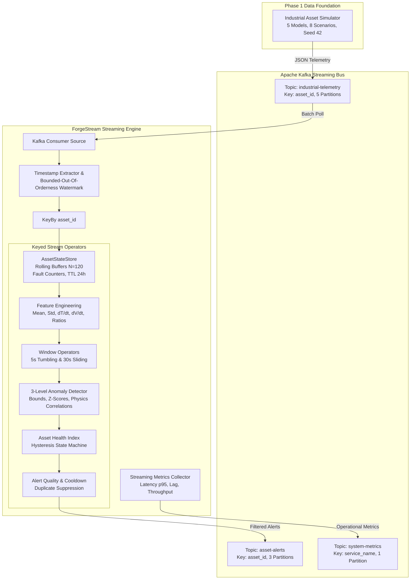
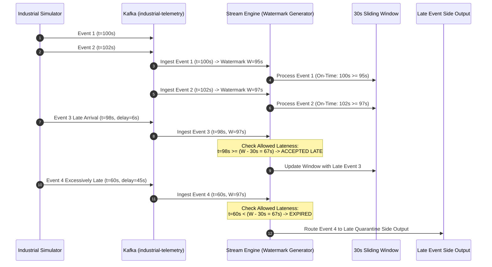
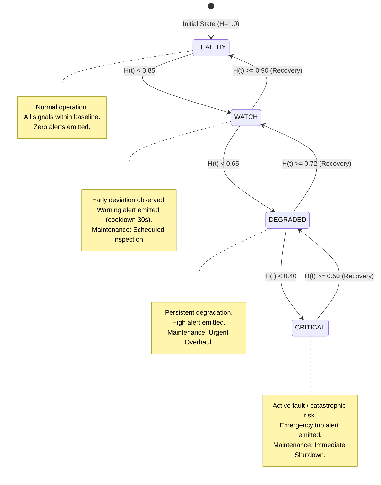

# ForgeStream Phase 2 Streaming & Window/State Technical Design

## 1. End-to-End Streaming Architecture

---

## 2. Event-Time & Watermark Lifecycle

---

## 3. Asset Health State Transitions & Hysteresis

---

## 4. Keyed State Model & Memory Footprint

### 4.1 Memory Allocation & Buffer Layout
Each asset partition manages an isolated `AssetStateStore` holding:
- `rolling_temp_buffer`: Fixed float array of size $N=120$ (~960 bytes)
- `rolling_vib_buffer`: Fixed float array of size $N=120$ (~960 bytes)
- `rolling_pres_buffer`: Fixed float array of size $N=120$ (~960 bytes)
- `rolling_current_buffer`: Fixed float array of size $N=120$ (~960 bytes)
- `rolling_power_buffer`: Fixed float array of size $N=120$ (~960 bytes)
- `rolling_load_buffer`: Fixed float array of size $N=120$ (~960 bytes)
- `timestamps_buffer`: Fixed float array of size $N=120$ (~960 bytes)
- **Total State Size per Asset**: $< 20\text{ KB}$
- **Total In-Memory Footprint for 1,000 Assets**: $< 20\text{ MB}$

### 4.2 State Recovery & Snapshotting
- Periodic state snapshots serialize in-memory `AssetStateStore` dictionaries to disk / memory checkpoints.
- On engine restart, the latest snapshot is loaded and streaming resumes seamlessly from the committed Kafka consumer group offset.

---

## 5. Performance Measurement Methodology

Performance metrics are captured continuously at 1.0-second intervals and emitted to `system-metrics`:
- **Ingestion Throughput ($R_{\text{in}}$)**: Number of events read from Kafka per second.
- **Processing Throughput ($R_{\text{proc}}$)**: Number of events fully evaluated through feature extraction, windowing, and anomaly detection per second.
- **End-to-End Latency ($L_{\text{e2e}}$)**: Time elapsed from sensor event timestamp to alert emission ($t_{\text{sink}} - t_{\text{event}}$).
- **Processing Latency ($L_{\text{proc}}$)**: Time elapsed from Kafka poll to sink dispatch ($t_{\text{dispatch}} - t_{\text{poll}}$). Measured at 50th, 95th, and 99th percentiles.
- **Watermark Lag ($\Delta_{\text{WM}}$)**: Discrepancy between maximum observed event time and the current watermark ($t_{\text{max}} - W(t)$).
